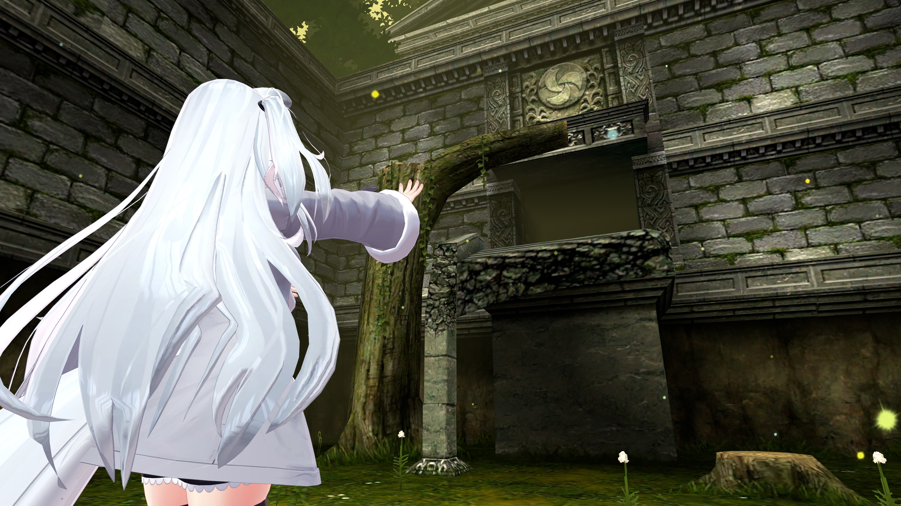

<!--
### Hi there 👋

**ccloli/ccloli** is a ✨ _special_ ✨ repository because its `README.md` (this file) appears on your GitHub profile.

Here are some ideas to get you started:

- 🔭 I’m currently working on ...
- 🌱 I’m currently learning ...
- 👯 I’m looking to collaborate on ...
- 🤔 I’m looking for help with ...
- 💬 Ask me about ...
- 📫 How to reach me: ...
- 😄 Pronouns: ...
- ⚡ Fun fact: ...
-->

<!--
<figure>
  

  I just wanna say for the record, um,
  that I do not want to kill myself, okay?

  I don't wanna kill myself,
  and I'm not going to kill myself.

  Um, and if you're out there and you're
  struggling with suicidal thoughts
  and you want to kill yourself,
  I just want to tell you don't.

  Okay? Can you not, please?
  Just don't. All right?

  Fucking quit it with the—
  But really, don't kill yourself.
  You don't want to, because…

  There are people that love you…
  That's not true necessarily,
  but there could be people
  that love you in the future,
  and just don't.

  I've had people close to me
  kill themselves,
  and I'll be honest with you,
  didn't love it.
  Didn't love that.
  So just don't.

  But if I could kill myself for a year…
  If I can— I'd do it today.

  If I could kill myself today and be dead
  until like 18 months from now,
  um, I would do it, but alas…

  …when you kill yourself,
  you're dead forever,
  and we shouldn't be dead forever yet.

  So let's not. Right?
  Come on, guys.

  

  <figcaption>
    <em>
      — <cite>Bo Burnham: Inside</cite> (2021)
    </em>
  </figcaption>
<figure>
-->

<h1 align="center">
  
  ***
  ▇▇▇▇▇▇▇▇▇▇
  ***

</h1>

  World: [Fallen Books](https://vrchat.com/home/world/wrld_74b0e92d-c3c9-463a-9782-b3878fb89a8c) by peipeiko  
  Avatar: [狐雪 / Koyuki](https://booth.pm/ja/items/2554585) by キュビクローゼット
  

<!--

<h1 align="center">
  
  ***
  _[Do you miss the old days?](https://www.youtube-nocookie.com/embed/vKT3V4Xx7Hs)_
  ***

</h1>

<small>Side notes: I didn't finish OOT though I've played it at least twice, not to say it's old (imo it's very modern), just pause it somewhere and never back, that's my bad. But every time I heard Lost Woods, even though the song sounds cheerful, I do feel a deep sorrow.</small>

  World: [Ocarina of Time 3D](https://vrchat.com/home/world/wrld_37abea33-f34c-4706-8e6b-2f69e414fc5d) by GigiSpahz  
  Avatar: [狐雪 / Koyuki](https://booth.pm/ja/items/2554585) by キュビクローゼット
  

-->

<!--  -->

<!--

<h1 align="center">
  
  ***
  _[Suicide](https://www.youtube.com/watch?v=4QXCPuwBz2E) = [Survive?](https://www.youtube.com/watch?v=vcw5THyM7Jo)_
  ***

</h1>

  World: [ORGANISM （v1․5）](https://vrchat.com/home/launch?worldId=wrld_de53549a-20cf-4c6f-abea-dcda197e1e16) by DrMorro  
  Avatar: [狐雪 / Koyuki](https://booth.pm/ja/items/2554585) by キュビクローゼット
  

-->